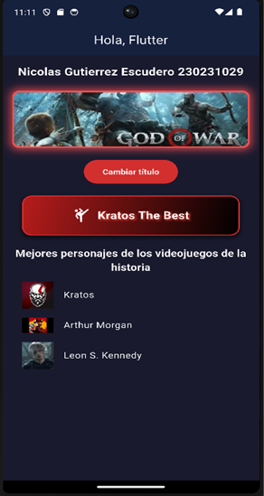
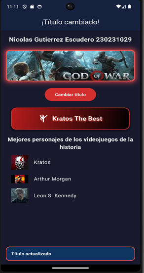

# Taller 1 - Flutter

## Descripción breve
Este proyecto es el resultado del primer taller de Flutter. Consiste en una aplicación móvil desarrollada con Flutter que muestra un estado inicial y un estado final (por ejemplo, después de una interacción del usuario). El objetivo del taller es familiarizarse con los fundamentos de Flutter, la estructura de un proyecto, la gestión de dependencias y la ejecución de la aplicación en un emulador o dispositivo físico.

## Datos del estudiante
- **Nombre completo:** Nicolas Gutierrez Escudero  
- **Código:** 230231029

## Capturas de pantalla
A continuación se muestran las capturas de pantalla que documentan el estado inicial y final de la aplicación:

| Estado inicial | Estado final |
|----------------|--------------|
|  |  |

Las imágenes se encuentran en la carpeta `capturas` dentro del proyecto.

## Pasos para ejecutar el proyecto
Sigue estos pasos para compilar y ejecutar la aplicación en tu entorno local:

1. **Clonar el repositorio** (o descargar el código fuente):
   ```bash
   git clone <url-del-repositorio>
   cd taller1_flutter
2. **Obtener las dependencias**
   ```bash
   flutter pub get
3. **Ejecutar la instalacion**
   ```bash
   flutter run 